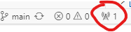
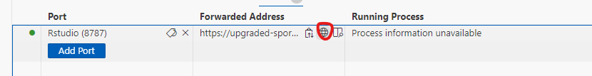

# CODESPACES setup

By initiating creation of codespace R version 4.3.1 will be installed togeather with harp.

Initially VsCode interface will be started.

To open RStudio Server, click the Forwarded Ports "Radio" icon at the bottom of the VS Code Online window.

In the Ports tab, click the Open in Browser "World" icon that appears when you hover in the "Forwarded Address" column for the Rstudio row.

This will launch RStudio Server in a new window. Log in with the username and password `rstudio/rstudio`.
